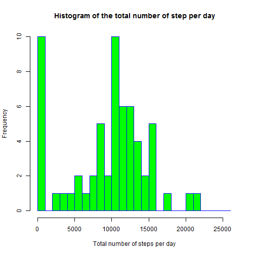
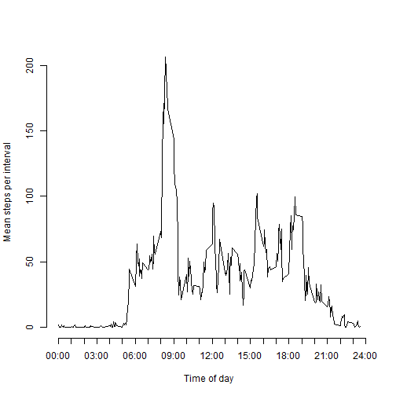
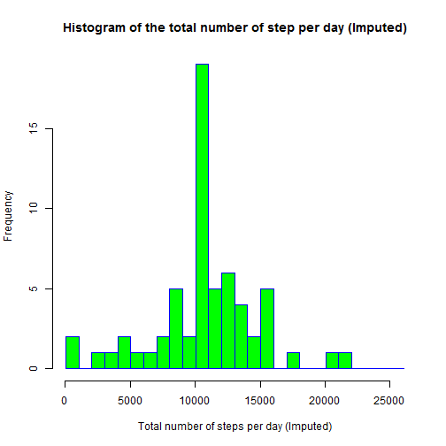
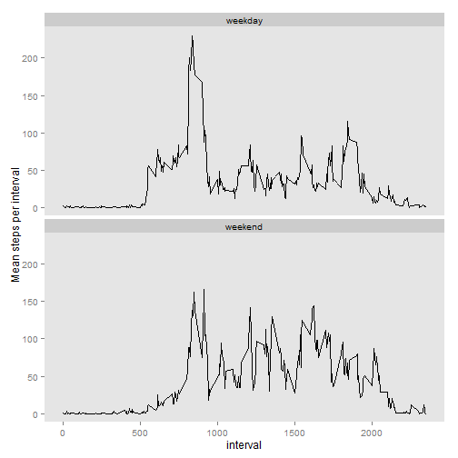

This assignment makes use of data from a personal activity monitoring device. This device collects data at 5 minute intervals through out the day. The data consists of two months of data from an anonymous individual collected during the months of October and November, 2012 and include the number of steps taken in 5 minute intervals each day.

```r
if (!file.exists("activity.csv")) {
  unzip("activity.zip")
}
```
## What is mean total number of steps taken per day?


```r
df <- read.csv("activity.csv")
days <- levels( as.factor(df$date) )
stepsPerDay <- sapply(days, function(x) sum(subset(df, date == x)$steps, na.rm=TRUE))

# plot the histogram
hist(stepsPerDay,breaks=seq(min(stepsPerDay),max(stepsPerDay) + 5000, by=1000), 
     xlim=c(min(stepsPerDay), max(stepsPerDay) + 5000),
     main="Histogram of the total number of step per day", 
     xlab="Total number of steps per day", col="green", border="blue")
```

 

```r
meanStepsPerDay <- mean(stepsPerDay)
medianStepsPerDay <- median(stepsPerDay)
```
* The mean total steps per day is 9354.23
* The median total steps per day is 10395

## What is the average daily activity pattern?

```r
intervalToString <- function(x) {
  paste(sprintf("%02d", as.integer(x/100)),
        ":",
        sprintf("%02d", as.integer(x %% 100)),
        sep="")
}

intervals <- as.numeric(levels(as.factor(df$interval)))
meanStepsPerInterval <- sapply(intervals, function(x) mean(subset(df, interval == x)$steps, na.rm=TRUE))
intervalsAsHours <- seq(0, 2400, by=100)
intervalStrings <- sapply(intervalsAsHours, intervalToString)

# plot the time line graph
plot(intervals, meanStepsPerInterval, xlab="Time of day", 
     ylab="Mean steps per interval",axes=FALSE, type="l")
axis(1,at=intervalsAsHours, labels=intervalStrings)
axis(2)
```

 

```r
busiestIntervalStr <- intervalToString(intervals[which.max(meanStepsPerInterval)])
```

* The interval with the highest average number of steps per day is 
08:35.

## Imputing missing values

```r
totalMissingValues <- sum(is.na(df$steps))
```
* The number of rows with missing values is 2304.

The strategy chosen to impute missing values is to replace them with the mean for the particular interval it applies to.


```r
newdf <- df

for (i in 1:nrow(newdf)) {
  if (is.na(newdf[i,]$steps)){
    newdf[i,]$steps <- meanStepsPerInterval[which(intervals == 
                                            newdf[i,]$interval)]
  }
}

imputedStepsPerDay <- sapply(days, function(x) sum(subset(newdf, date == x)$steps, na.rm=TRUE))

# plot the histogram
hist(imputedStepsPerDay,breaks=seq(min(imputedStepsPerDay),max(imputedStepsPerDay) + 5000, by=1000), 
     xlim=c(min(imputedStepsPerDay), max(imputedStepsPerDay) + 5000),
     main="Histogram of the total number of step per day (Imputed)", 
     xlab="Total number of steps per day (Imputed)", col="green", border="blue")
```

 

```r
imputedMeanStepsPerDay <- mean(imputedStepsPerDay)
imputedMedianStepsPerDay <- median(imputedStepsPerDay)
if (imputedMeanStepsPerDay > meanStepsPerDay) {
  totalSteps <- "increases"
} else {
  totalSteps <- "decreases"
}
```
* The mean total steps per day changed from 9354.23 to  10766.19
* The median total steps per day changed from 10395.00 to 10766.19

The effect of imputing missing data increases the total number of daily steps.

## Are there differences in activity patterns between weekdays and weekends?

```r
library(ggplot2)
days <- weekdays(as.Date(newdf$date))

newdf$day <- "weekday"
newdf$day[days == "Saturday" | days == "Sunday"] <- "weekend"

newdf <- aggregate(newdf$steps, list(interval=newdf$interval, day=newdf$day), mean)

names(newdf)[3] <- "steps"

ggplot(newdf, aes(interval, steps)) + geom_line() + facet_wrap( ~ day, ncol=1) +
  ylab("Mean steps per interval") +
  theme(panel.grid.major=element_blank(),panel.grid.minor=element_blank())
```

 
